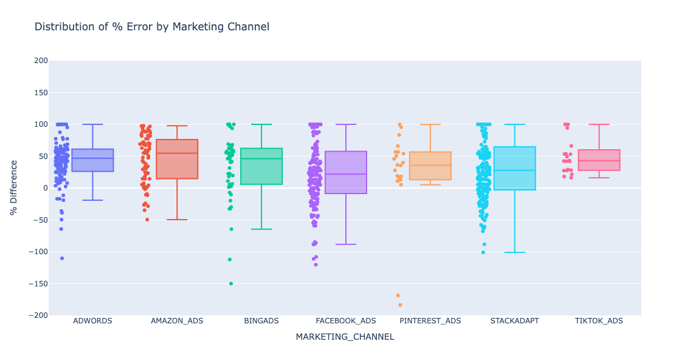
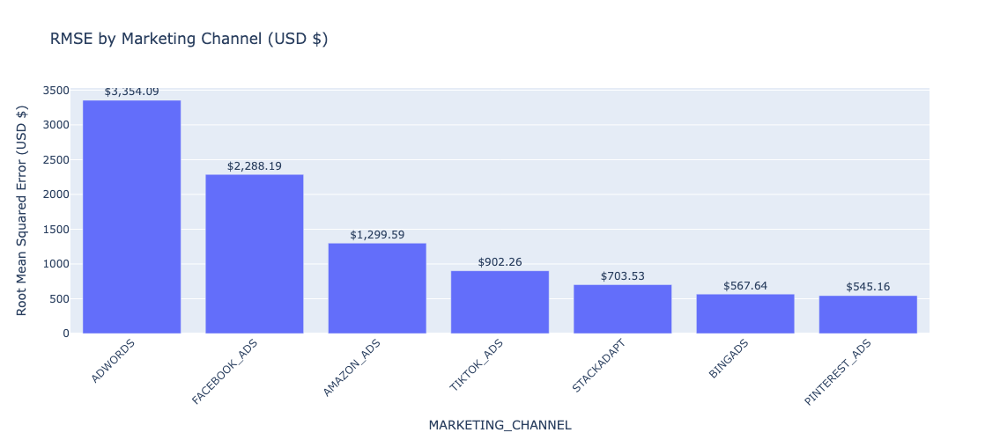

# AI-MMM-Evaluation EDA

## AI Marketing Mix Model Evaluation EDA Analysis

This project evaluates the performance of an AI model that predicts marketing channel revenue compared to **actual reported revenue**.  
It includes error analysis, visualizations, and a presentation of key findings.

---

##  Project Overview
The goal of this project is to:
- Compare **predicted (modeled) revenue** against **actual channel-reported revenue**.
- Visualize performance with intuitive charts.
- Quantify accuracy using standard error metrics.
- Identify strengths, weaknesses, and potential biases in the model.

## The visualizations and metrics included allow you to:
- Compare actual vs modeled revenue.
- Track residuals and errors over time.
- Evaluate performance by marketing channel.
- Examine input feature correlations.
- Detect systematic biases or underperforming channels.
---
##  Key Features

###  Model KPIs
- **MAE (Mean Absolute Error)**
- **RMSE (Root Mean Squared Error)**
- **MAPE (Mean Absolute Percentage Error)**

## Visual Functions

| Function                        | Purpose                                                                     |
| ------------------------------- | --------------------------------------------------------------------------- |
| `scatter_actual_vs_modeled()` | Plots actual vs modeled revenue to quickly assess overall fit.              |
| `time_series_revenue()`       | Visualizes revenue trends over time for both actual and modeled values.     |
| `error_over_time()`           | Plots residuals (actual - modeled) to detect temporal bias or drift.        |
| `box_plot_error_by_channel()` | Shows distribution of % errors by marketing channel.                        |
| `rmse_by_channel()`           | Computes and visualizes RMSE per channel to identify large errors.          |
| `error_histogram()`           | Displays the distribution of prediction errors to spot systemic bias.       |
| `correlation_heatmap()`       | Shows correlation among numeric input features to detect multicollinearity. |

---
Sample Images:

### Error Distribution

### RMSE by Channel (Production Data)

## 📑 Results Summary
- Predictions generally tracked real revenue trends, with residuals being under $2,000 off. This is shown by the MAPE being between 20% and 10% in development and production.    
- Some channels showed **systematic bias**:
  ADWORDS ads showed a high unpredictability, while Pinterest ads captured better RMSE.  
- Certain features were highly correlated, suggesting possible model simplification.  
- Overall error rates were within an interpretable range but highlighted areas for model refinement.

